<!--
 * @Author: julius 2024-05-16 
 * @LastEditTime: 2025-07-19 16:42
-->

# 雪橇管理系统 API 文档

## 目录
1. [获取雪橇列表](#1-获取雪橇列表)
2. [新增雪橇](#2-新增雪橇)
3. [更新雪橇信息](#3-更新雪橇信息)
4. [获取雪橇详情](#4-获取雪橇详情)
5. [根据雪橇编号查询雪橇信息](#5-根据雪橇编号查询雪橇信息)
6. [获取雪橇清洁度历史记录](#6-获取雪橇清洁度历史记录)
7. [获取雪橇上下线历史记录（带状态筛选）](#7-获取雪橇上下线历史记录)
8. [获取雪橇清洁度历史记录（带状态筛选）](#8-获取雪橇清洁度历史记录带状态筛选)
9. [获取雪橇清洁度变化趋势数据](#9-获取雪橇清洁度变化趋势数据)
10. [获取雪橇上下线状态趋势数据](#10-获取雪橇上下线状态趋势数据)
11. [获取雪橇状态统计数据](#11-获取雪橇状态统计数据)

## 1. 获取雪橇列表

**接口名称：** 获取雪橇列表
**功能描述：** 根据查询条件获取雪橇列表数据，支持分页和筛选
**接口地址：** /api/skid/list
**请求方式：** POST

### 功能说明
该接口用于获取符合条件的雪橇列表，支持多种筛选条件，包括雪橇编号、清洁度状态、上下线状态、检测时间范围和状态变更时间范围等。

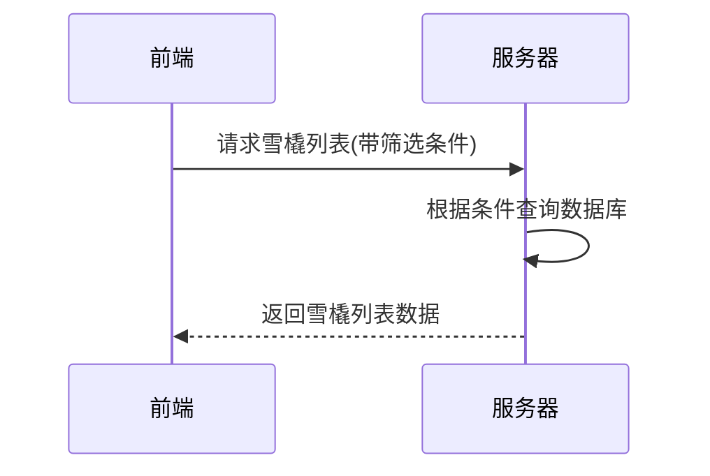

### 请求参数
```json
{
  "page": 1,
  "size": 10,
  "skidId": "SK001",
  "cleanStatus": "C",
  "onlineStatus": "online",
  "inspectionTimeStart": "2024-05-01 00:00:00",
  "inspectionTimeEnd": "2024-05-16 23:59:59",
  "statusChangeTimeStart": "2024-05-01 00:00:00",
  "statusChangeTimeEnd": "2024-05-16 23:59:59"
}
```

| 参数名 | 类型 | 必填 | 说明 | 示例值 |
|-------|-----|-----|------|-------|
| page | int | 是 | 页码 | 1 |
| size | int | 是 | 每页数量 | 10 |
| skidId | string | 否 | 雪橇编号 | SK001 |
| cleanStatus | string | 否 | 清洁度状态(C:清洁,M:中度,S:严重) | C |
| onlineStatus | string | 否 | 上下线状态(online:在线,offline:离线,cleaning:清洗中) | online |
| inspectionTimeStart | string | 否 | 检测开始时间 | 2024-05-01 00:00:00 |
| inspectionTimeEnd | string | 否 | 检测结束时间 | 2024-05-16 23:59:59 |
| statusChangeTimeStart | string | 否 | 状态变更开始时间 | 2024-05-01 00:00:00 |
| statusChangeTimeEnd | string | 否 | 状态变更结束时间 | 2024-05-16 23:59:59 |

### 响应参数
```json
{
  "code": 200,
  "message": "获取雪橇列表成功",
  "ok": true,
  "data": {
    "records": [
      {
        "skidId": "SK001",
        "cleanStatus": "C",
        "inspectionTime": "2024-05-15 08:30:25",
        "onlineStatus": "online",
        "statusChangeTime": "2024-05-15 08:30:00",
        "remarks": "正常运行",
        "lastPhoto": "https://example.com/photos/sk001.jpg"
      },
      {
        "skidId": "SK002",
        "cleanStatus": "M",
        "inspectionTime": "2024-05-15 09:15:32",
        "onlineStatus": "online",
        "statusChangeTime": "2024-05-14 14:22:10",
        "remarks": "需要定期清洁",
        "lastPhoto": "https://example.com/photos/sk002.jpg"
      }
    ],
    "total": 8,
    "size": 10,
    "current": 1
  }
}
```

| 参数名 | 类型 | 必填 | 说明 | 示例值 |
|-------|-----|-----|------|-------|
| code | int | 是 | 状态码 | 200 |
| message | string | 是 | 响应消息 | 获取雪橇列表成功 |
| ok | boolean | 是 | 是否成功 | true |
| data | object | 是 | 响应数据 | |
| data.records | array | 是 | 雪橇列表 | |
| data.records[].skidId | string | 是 | 雪橇编号 | SK001 |
| data.records[].cleanStatus | string | 是 | 清洁度状态 | C |
| data.records[].inspectionTime | string | 是 | 检测时间 | 2024-05-15 08:30:25 |
| data.records[].onlineStatus | string | 是 | 上下线状态 | online |
| data.records[].statusChangeTime | string | 是 | 状态变更时间 | 2024-05-15 08:30:00 |
| data.records[].remarks | string | 否 | 备注 | 正常运行 |
| data.records[].lastPhoto | string | 否 | 最新照片URL | https://example.com/photos/sk001.jpg |
| data.total | int | 是 | 总记录数 | 8 |
| data.size | int | 是 | 每页记录数 | 10 |
| data.current | int | 是 | 当前页码 | 1 |

## 2. 新增雪橇

**接口名称：** 新增雪橇
**功能描述：** 新增一个雪橇记录到系统中
**接口地址：** /api/skid/add
**请求方式：** POST

### 功能说明
该接口用于在系统中添加新的雪橇记录，包括基本信息和状态信息。支持上传雪橇的检测照片。

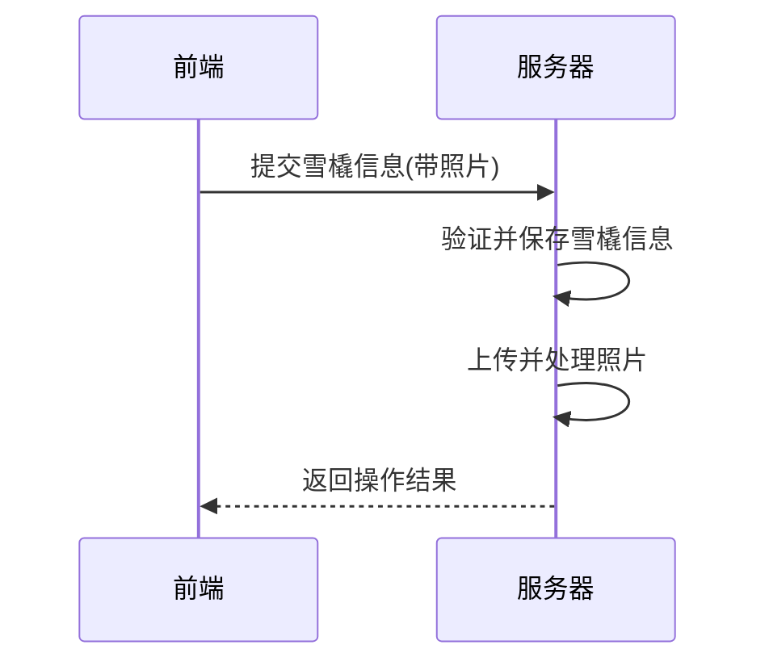

### 请求参数
```json
// 注意：实际请求使用FormData格式，这里仅为展示
{
  "skidId": "SK009",
  "cleanStatus": "C",
  "onlineStatus": "online",
  "remarks": "新增雪橇",
  "photo": [文件对象]
}
```

| 参数名 | 类型 | 必填 | 说明 | 示例值 |
|-------|-----|-----|------|-------|
| skidId | string | 是 | 雪橇编号 | SK009 |
| cleanStatus | string | 是 | 清洁度状态 | C |
| onlineStatus | string | 是 | 上下线状态 | online |
| remarks | string | 否 | 备注 | 新增雪橇 |
| photo | file | 否 | 照片文件 | - |

### 响应参数
```json
{
  "code": 200,
  "message": "新增雪橇成功",
  "ok": true
}
```

| 参数名 | 类型 | 必填 | 说明 | 示例值 |
|-------|-----|-----|------|-------|
| code | int | 是 | 状态码 | 200 |
| message | string | 是 | 响应消息 | 新增雪橇成功 |
| ok | boolean | 是 | 是否成功 | true |

## 3. 更新雪橇信息

**接口名称：** 更新雪橇信息
**功能描述：** 更新已有雪橇的信息
**接口地址：** /api/skid/update
**请求方式：** POST

### 功能说明
该接口用于更新系统中已存在的雪橇记录信息，可以更新清洁度状态、上下线状态、备注以及检测照片。系统会自动记录状态变更的时间。

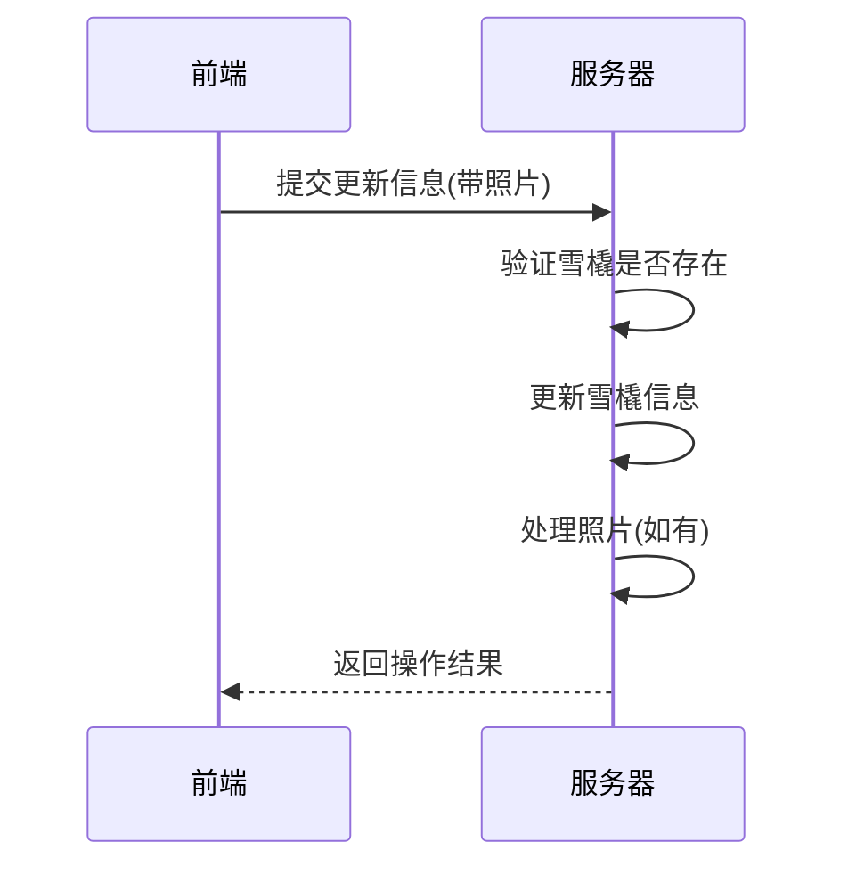

### 请求参数
```json
// 注意：实际请求使用FormData格式，这里仅为展示
{
  "skidId": "SK001",
  "cleanStatus": "M",
  "onlineStatus": "offline",
  "remarks": "需要清洁",
  "photo": [文件对象]
}
```

| 参数名 | 类型 | 必填 | 说明 | 示例值 |
|-------|-----|-----|------|-------|
| skidId | string | 是 | 雪橇编号 | SK001 |
| cleanStatus | string | 否 | 清洁度状态 | M |
| onlineStatus | string | 否 | 上下线状态 | offline |
| remarks | string | 否 | 备注 | 需要清洁 |
| photo | file | 否 | 照片文件 | - |

### 响应参数
```json
{
  "code": 200,
  "message": "更新雪橇信息成功",
  "ok": true
}
```

| 参数名 | 类型 | 必填 | 说明 | 示例值 |
|-------|-----|-----|------|-------|
| code | int | 是 | 状态码 | 200 |
| message | string | 是 | 响应消息 | 更新雪橇信息成功 |
| ok | boolean | 是 | 是否成功 | true |

## 4. 获取雪橇详情

**接口名称：** 获取雪橇详情
**功能描述：** 根据雪橇编号获取雪橇详细信息
**接口地址：** /api/skid/detail
**请求方式：** GET

### 功能说明
该接口用于获取指定雪橇的详细信息，包括基本信息、当前状态以及最近的检测记录。

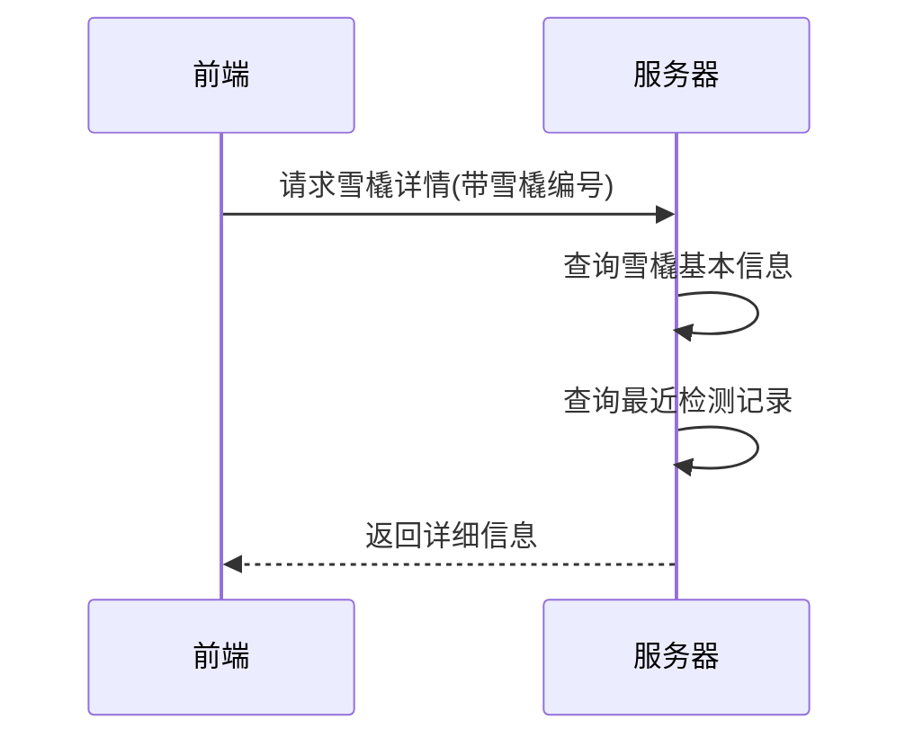

### 请求参数
```
?skidId=SK001
```

| 参数名 | 类型 | 必填 | 说明 | 示例值 |
|-------|-----|-----|------|-------|
| skidId | string | 是 | 雪橇编号 | SK001 |

### 响应参数
```json
{
  "code": 200,
  "message": "获取雪橇详情成功",
  "ok": true,
  "data": {
    "skidId": "SK001",
    "cleanStatus": "C",
    "inspectionTime": "2024-05-15 08:30:25",
    "onlineStatus": "online",
    "statusChangeTime": "2024-05-15 08:30:00",
    "remarks": "正常运行",
    "lastPhoto": "https://example.com/photos/sk001.jpg",
    "lastInspector": "张三",
    "lastInspectionMethod": "自动检测"
  }
}
```

| 参数名 | 类型 | 必填 | 说明 | 示例值 |
|-------|-----|-----|------|-------|
| code | int | 是 | 状态码 | 200 |
| message | string | 是 | 响应消息 | 获取雪橇详情成功 |
| ok | boolean | 是 | 是否成功 | true |
| data | object | 是 | 雪橇详细信息 | |
| data.skidId | string | 是 | 雪橇编号 | SK001 |
| data.cleanStatus | string | 是 | 清洁度状态 | C |
| data.inspectionTime | string | 是 | 检测时间 | 2024-05-15 08:30:25 |
| data.onlineStatus | string | 是 | 上下线状态 | online |
| data.statusChangeTime | string | 是 | 状态变更时间 | 2024-05-15 08:30:00 |
| data.remarks | string | 否 | 备注 | 正常运行 |
| data.lastPhoto | string | 否 | 最新照片URL | https://example.com/photos/sk001.jpg |
| data.lastInspector | string | 否 | 最近检测人员 | 张三 |
| data.lastInspectionMethod | string | 否 | 最近检测方式 | 自动检测 |

## 5. 根据雪橇编号查询雪橇信息

**接口名称：** 根据雪橇编号查询雪橇信息
**功能描述：** 通过雪橇编号(skid_id)获取雪橇的详细信息
**接口地址：** /api/skid/info/{skidId}
**请求方式：** GET

### 功能说明
该接口用于通过雪橇编号直接查询雪橇的所有信息，包括基本信息、状态信息等。

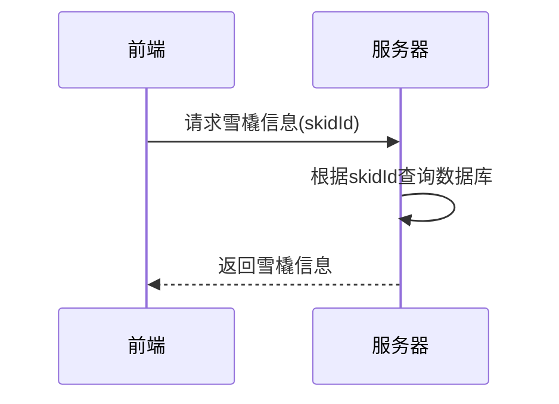

### 请求参数

| 参数名 | 类型 | 必填 | 说明 | 示例值 |
|-------|-----|-----|------|-------|
| skidId | string | 是 | 雪橇编号 | SK001 |

### 响应参数
```json
{
  "code": 200,
  "message": "根据雪橇编号获取雪橇信息成功",
  "ok": true,
  "data": {
    "id": 1,
    "skidId": "SK001",
    "cleanStatus": "C",
    "inspectionTime": "2024-05-15 08:30:25",
    "onlineStatus": "online",
    "statusChangeTime": "2024-05-15 08:30:00",
    "remarks": "正常运行",
    "lastPhoto": "https://example.com/photos/sk001.jpg",
    "createdAt": "2024-05-01 10:00:00",
    "updatedAt": "2024-05-15 08:30:25"
  }
}
```

| 参数名 | 类型 | 必填 | 说明 | 示例值 |
|-------|-----|-----|------|-------|
| code | int | 是 | 状态码 | 200 |
| message | string | 是 | 响应消息 | 根据雪橇编号获取雪橇信息成功 |
| ok | boolean | 是 | 是否成功 | true |
| data | object | 是 | 雪橇信息 | |
| data.id | int | 是 | 自增主键ID | 1 |
| data.skidId | string | 是 | 雪橇编号 | SK001 |
| data.cleanStatus | string | 是 | 清洁度状态 | C |
| data.inspectionTime | string | 是 | 检测时间 | 2024-05-15 08:30:25 |
| data.onlineStatus | string | 是 | 上下线状态 | online |
| data.statusChangeTime | string | 是 | 状态变更时间 | 2024-05-15 08:30:00 |
| data.remarks | string | 否 | 备注 | 正常运行 |
| data.lastPhoto | string | 否 | 最新照片URL | https://example.com/photos/sk001.jpg |
| data.createdAt | string | 是 | 创建时间 | 2024-05-01 10:00:00 |
| data.updatedAt | string | 是 | 更新时间 | 2024-05-15 08:30:25 |

### 错误响应
```json
{
  "code": 404,
  "message": "雪橇不存在",
  "ok": false
}
```

## 6. 获取雪橇清洁度历史记录

**接口名称：** 获取雪橇清洁度历史记录
**功能描述：** 获取特定雪橇的清洁度检测历史记录，支持分页和时间筛选
**接口地址：** /api/skid/inspection-history
**请求方式：** POST

### 功能说明
该接口用于查询指定雪橇的清洁度检测历史记录，可按时间范围筛选，并支持分页查询。

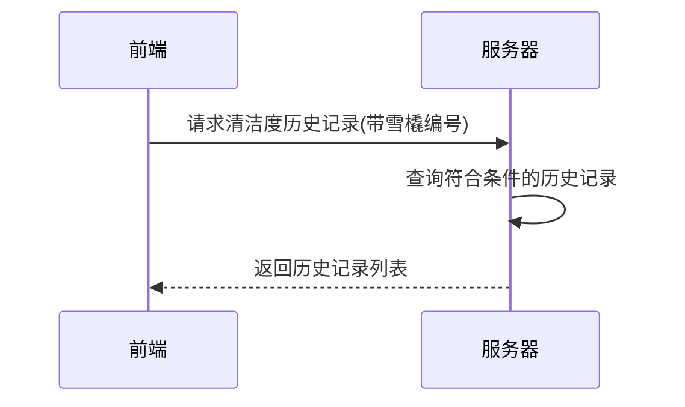

### 请求参数
```json
{
  "skidId": "SK001",
  "page": 1,
  "size": 10,
  "startTime": "2024-05-01 00:00:00",
  "endTime": "2024-05-16 23:59:59"
}
```

| 参数名 | 类型 | 必填 | 说明 | 示例值 |
|-------|-----|-----|------|-------|
| skidId | string | 是 | 雪橇编号 | SK001 |
| page | int | 是 | 页码 | 1 |
| size | int | 是 | 每页数量 | 10 |
| startTime | string | 否 | 开始时间 | 2024-05-01 00:00:00 |
| endTime | string | 否 | 结束时间 | 2024-05-16 23:59:59 |

### 响应参数
```json
{
  "code": 200,
  "message": "获取清洁度历史记录成功",
  "ok": true,
  "data": {
    "records": [
      {
        "id": 1,
        "skidId": "SK001",
        "inspectionTime": "2024-05-15 08:30:25",
        "cleanStatus": "C",
        "inspector": "张三",
        "inspectionMethod": "自动检测",
        "photoUrl": "https://example.com/photos/sk001_20240515083025.jpg",
        "remarks": "例行检查，未发现异常"
      },
      {
        "id": 2,
        "skidId": "SK001",
        "inspectionTime": "2024-05-14 09:15:32",
        "cleanStatus": "C",
        "inspector": "李四",
        "inspectionMethod": "人工检测",
        "photoUrl": "https://example.com/photos/sk001_20240514091532.jpg",
        "remarks": "清洁后复检，状态良好"
      }
    ],
    "total": 7,
    "size": 10,
    "current": 1
  }
}
```

| 参数名 | 类型 | 必填 | 说明 | 示例值 |
|-------|-----|-----|------|-------|
| code | int | 是 | 状态码 | 200 |
| message | string | 是 | 响应消息 | 获取清洁度历史记录成功 |
| ok | boolean | 是 | 是否成功 | true |
| data | object | 是 | 响应数据 | |
| data.records | array | 是 | 历史记录列表 | |
| data.records[].id | int | 是 | 记录ID | 1 |
| data.records[].skidId | string | 是 | 雪橇编号 | SK001 |
| data.records[].inspectionTime | string | 是 | 检测时间 | 2024-05-15 08:30:25 |
| data.records[].cleanStatus | string | 是 | 清洁度状态 | C |
| data.records[].inspector | string | 是 | 检测人员 | 张三 |
| data.records[].inspectionMethod | string | 是 | 检测方式 | 自动检测 |
| data.records[].photoUrl | string | 否 | 照片URL | https://example.com/photos/sk001_20240515083025.jpg |
| data.records[].remarks | string | 否 | 备注 | 例行检查，未发现异常 |
| data.total | int | 是 | 总记录数 | 7 |
| data.size | int | 是 | 每页记录数 | 10 |
| data.current | int | 是 | 当前页码 | 1 |

## 7. 获取雪橇上下线历史记录

**接口名称：** 获取雪橇上下线历史记录
**功能描述：** 获取特定雪橇的上下线历史记录，支持分页、状态筛选和时间筛选
**接口地址：** /api/skid/status-history
**请求方式：** POST

### 功能说明
该接口用于查询指定雪橇的上下线状态变更历史记录，可按上下线状态和时间范围筛选，并支持分页查询。

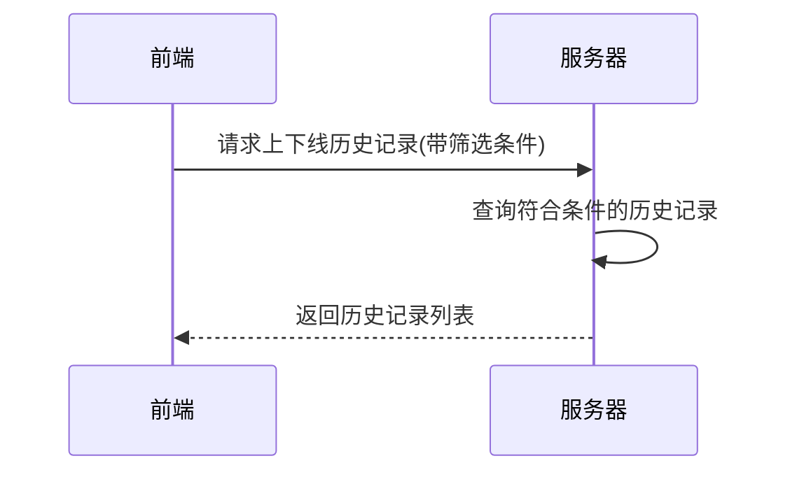

### 请求参数
```json
{
  "skidId": "SK001",
  "page": 1,
  "size": 10,
  "onlineStatus": "online",
  "startTime": "2024-05-01 00:00:00",
  "endTime": "2024-05-16 23:59:59"
}
```

| 参数名 | 类型 | 必填 | 说明 | 示例值 |
|-------|-----|-----|------|-------|
| skidId | string | 是 | 雪橇编号 | SK001 |
| page | int | 是 | 页码 | 1 |
| size | int | 是 | 每页数量 | 10 |
| onlineStatus | string | 否 | 上下线状态(online:在线,offline:离线,cleaning:清洗中) | online |
| startTime | string | 否 | 开始时间 | 2024-05-01 00:00:00 |
| endTime | string | 否 | 结束时间 | 2024-05-16 23:59:59 |

### 响应参数
```json
{
  "code": 200,
  "message": "获取上下线历史记录成功",
  "ok": true,
  "data": {
    "records": [
      {
        "id": 1,
        "skidId": "SK001",
        "statusChangeTime": "2024-05-15 08:30:00",
        "onlineStatus": "online",
        "operator": "张三",
        "duration": "16小时25分",
        "reason": "例行上线"
      },
      {
        "id": 2,
        "skidId": "SK001",
        "statusChangeTime": "2024-05-14 16:05:00",
        "onlineStatus": "offline",
        "operator": "李四",
        "duration": "8小时10分",
        "reason": "设备检修"
      }
    ],
    "total": 7,
    "size": 10,
    "current": 1
  }
}
```

| 参数名 | 类型 | 必填 | 说明 | 示例值 |
|-------|-----|-----|------|-------|
| code | int | 是 | 状态码 | 200 |
| message | string | 是 | 响应消息 | 获取上下线历史记录成功 |
| ok | boolean | 是 | 是否成功 | true |
| data | object | 是 | 响应数据 | |
| data.records | array | 是 | 历史记录列表 | |
| data.records[].id | int | 是 | 记录ID | 1 |
| data.records[].skidId | string | 是 | 雪橇编号 | SK001 |
| data.records[].statusChangeTime | string | 是 | 状态变更时间 | 2024-05-15 08:30:00 |
| data.records[].onlineStatus | string | 是 | 上下线状态 | online |
| data.records[].operator | string | 是 | 操作人员 | 张三 |
| data.records[].duration | string | 否 | 持续时间 | 16小时25分 |
| data.records[].reason | string | 否 | 原因 | 例行上线 |
| data.total | int | 是 | 总记录数 | 7 |
| data.size | int | 是 | 每页记录数 | 10 |
| data.current | int | 是 | 当前页码 | 1 | 

## 8. 获取雪橇清洁度历史记录（带状态筛选）

**接口名称：** 获取雪橇清洁度历史记录（带状态筛选）
**功能描述：** 根据雪橇编号获取清洁度历史记录，支持按清洁度状态和时间范围进行筛选
**接口地址：** /api/skid/clean-history
**请求方式：** POST

### 功能说明
该接口用于获取特定雪橇的清洁度历史记录，可以按清洁度状态和时间范围进行筛选，并支持分页查询。主要用于雪橇清洁度历史记录页面的数据展示。

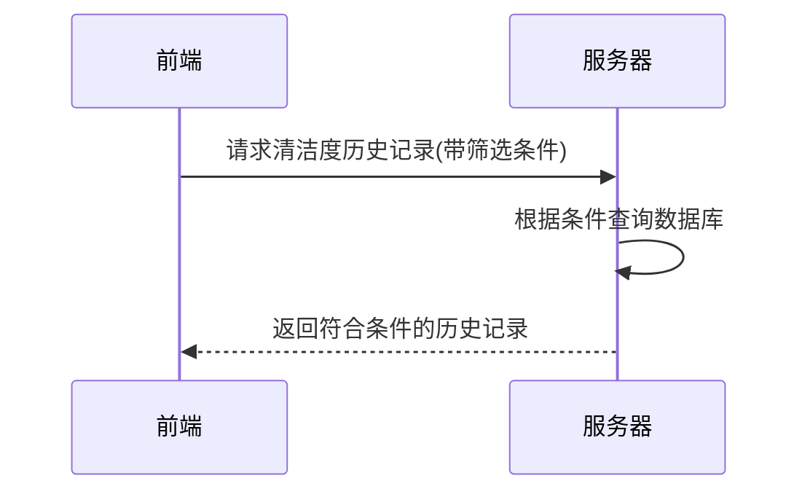

### 请求参数
```json
{
  "skidId": "SK001",
  "cleanStatus": "C",
  "timeRange": [
    "2024-05-01 00:00:00",
    "2024-05-31 23:59:59"
  ],
  "page": 1,
  "size": 10
}
```

| 参数名 | 类型 | 必填 | 说明 | 示例值 |
|-------|-----|-----|------|-------|
| skidId | string | 是 | 雪橇编号 | SK001 |
| cleanStatus | string | 否 | 清洁度状态(C:清洁,M:中度,S:严重) | C |
| timeRange | array | 否 | 时间范围 | ["2024-05-01 00:00:00", "2024-05-31 23:59:59"] |
| page | int | 是 | 页码 | 1 |
| size | int | 是 | 每页数量 | 10 |

### 响应参数
```json
{
  "code": 200,
  "message": "获取雪橇清洁度历史记录成功",
  "ok": true,
  "data": {
    "records": [
      {
        "id": 1,
        "skidId": "SK001",
        "inspectionTime": "2024-05-15 08:30:25",
        "cleanStatus": "C",
        "inspector": "张三",
        "inspectionMethod": "自动检测",
        "remarks": "例行检查，未发现异常",
        "photos": [
          "https://example.com/photos/sk001_1.jpg",
          "https://example.com/photos/sk001_2.jpg"
        ]
      },
      {
        "id": 2,
        "skidId": "SK001",
        "inspectionTime": "2024-05-14 09:15:32",
        "cleanStatus": "C",
        "inspector": "李四",
        "inspectionMethod": "人工检测",
        "remarks": "清洁后复检，状态良好",
        "photos": [
          "https://example.com/photos/sk001_3.jpg"
        ]
      }
    ],
    "total": 7,
    "size": 10,
    "current": 1
  }
}
```

| 参数名 | 类型 | 必填 | 说明 | 示例值 |
|-------|-----|-----|------|-------|
| code | int | 是 | 状态码 | 200 |
| message | string | 是 | 响应消息 | 获取雪橇清洁度历史记录成功 |
| ok | boolean | 是 | 是否成功 | true |
| data | object | 是 | 响应数据 | |
| data.records | array | 是 | 历史记录列表 | |
| data.records[].id | int | 是 | 记录ID | 1 |
| data.records[].skidId | string | 是 | 雪橇编号 | SK001 |
| data.records[].inspectionTime | string | 是 | 检测时间 | 2024-05-15 08:30:25 |
| data.records[].cleanStatus | string | 是 | 清洁度状态 | C |
| data.records[].inspector | string | 是 | 检测人员 | 张三 |
| data.records[].inspectionMethod | string | 是 | 检测方式 | 自动检测 |
| data.records[].remarks | string | 否 | 备注 | 例行检查，未发现异常 |
| data.records[].photos | array | 否 | 照片URL数组 | ["https://example.com/photos/sk001_1.jpg", "https://example.com/photos/sk001_2.jpg"] |
| data.total | int | 是 | 总记录数 | 7 |
| data.size | int | 是 | 每页记录数 | 10 |
| data.current | int | 是 | 当前页码 | 1 |

## 9. 获取雪橇清洁度变化趋势数据

**接口名称：** 获取雪橇清洁度变化趋势数据
**功能描述：** 获取特定雪橇在指定时间范围内的清洁度变化趋势数据
**接口地址：** /api/skid/clean-trend
**请求方式：** GET

### 功能说明
该接口用于获取特定雪橇在指定时间范围内的清洁度状态变化趋势，支持查看最近一周、最近一个月或最近一年的数据。主要用于雪橇清洁度历史记录页面的趋势图展示。

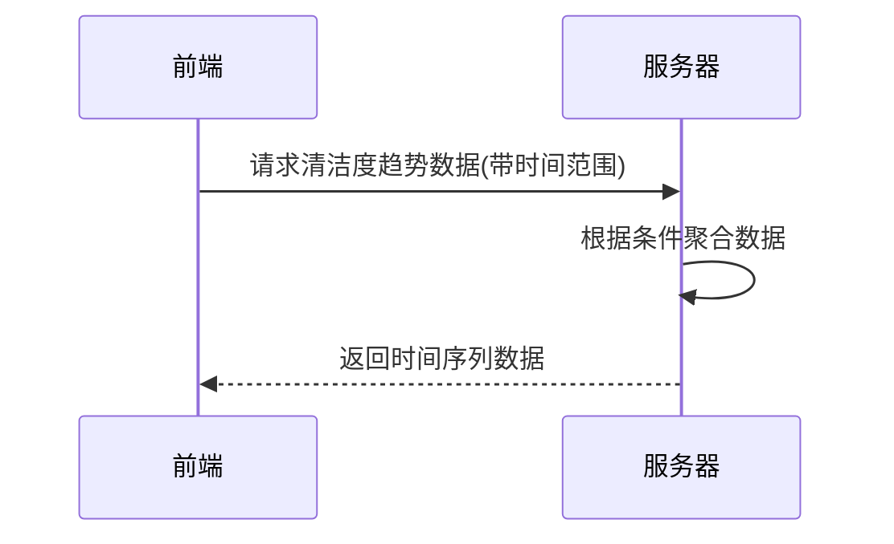

### 请求参数
```
?skidId=SK001&timeRange=month
```

| 参数名 | 类型 | 必填 | 说明 | 示例值 |
|-------|-----|-----|------|-------|
| skidId | string | 是 | 雪橇编号 | SK001 |
| timeRange | string | 是 | 时间范围(week:最近一周,month:最近一个月,year:最近一年) | month |

### 响应参数
```json
{
  "code": 200,
  "message": "获取雪橇清洁度趋势数据成功",
  "ok": true,
  "data": {
    "dates": [
      "2024-05-01 08:30:25",
      "2024-05-02 10:45:18",
      "2024-05-03 14:22:33",
      "2024-05-04 09:10:05",
      "2024-05-05 16:30:42"
    ],
    "statusValues": [
      1,
      1,
      2,
      3,
      1
    ],
    "statusMap": {
      "1": "清洁 (C)",
      "2": "中度 (M)",
      "3": "严重 (S)"
    }
  }
}
```

| 参数名 | 类型 | 必填 | 说明 | 示例值 |
|-------|-----|-----|------|-------|
| code | int | 是 | 状态码 | 200 |
| message | string | 是 | 响应消息 | 获取雪橇清洁度趋势数据成功 |
| ok | boolean | 是 | 是否成功 | true |
| data | object | 是 | 响应数据 | |
| data.dates | array | 是 | 日期时间列表 | ["2024-05-01 08:30:25", "2024-05-02 10:45:18", "2024-05-03 14:22:33", "2024-05-04 09:10:05", "2024-05-05 16:30:42"] |
| data.statusValues | array | 是 | 状态值列表(1:清洁,2:中度,3:严重) | [1, 1, 2, 3, 1] |
| data.statusMap | object | 是 | 状态值映射 | {"1": "清洁 (C)", "2": "中度 (M)", "3": "严重 (S)"} | 

## 10. 获取雪橇上下线状态趋势数据

**接口名称：** 获取雪橇上下线状态趋势数据
**功能描述：** 获取特定雪橇在指定时间范围内的上下线状态变化趋势数据
**接口地址：** /api/skid/status-trend
**请求方式：** GET

### 功能说明
该接口用于获取特定雪橇在指定时间范围内的上下线状态变化趋势，支持查看最近一周、最近一个月或最近一年的数据。主要用于雪橇上下线历史记录页面的趋势图展示。

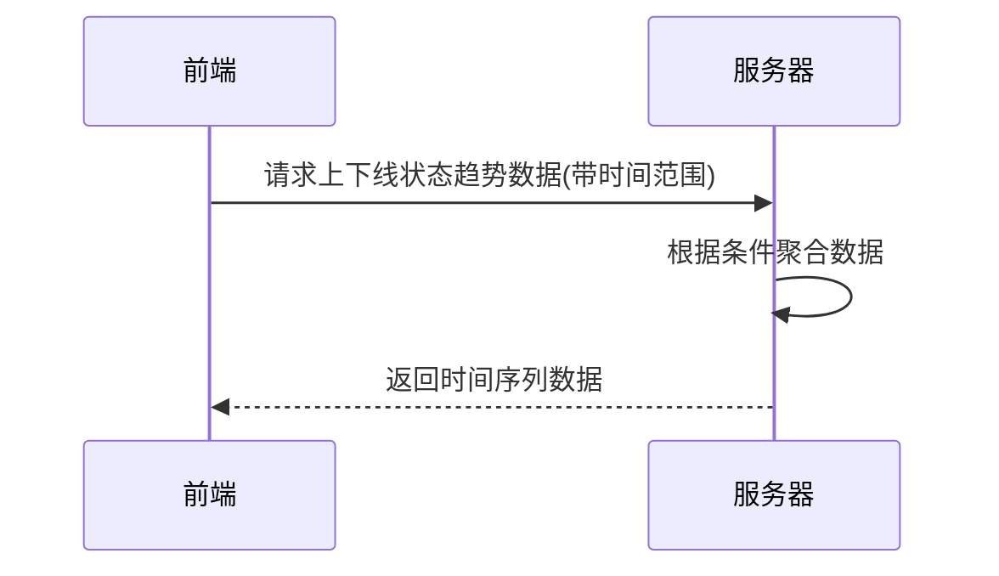

### 请求参数
```
?skidId=SK001&timeRange=month
```

| 参数名 | 类型 | 必填 | 说明 | 示例值 |
|-------|-----|-----|------|-------|
| skidId | string | 是 | 雪橇编号 | SK001 |
| timeRange | string | 是 | 时间范围(week:最近一周,month:最近一个月,year:最近一年) | month |

### 响应参数
```json
{
  "code": 200,
  "message": "获取雪橇上下线状态趋势数据成功",
  "ok": true,
  "data": {
    "dates": [
     "2024-05-01 08:30:25",
      "2024-05-02 10:45:18",
      "2024-05-03 14:22:33",
      "2024-05-04 09:10:05",
      "2024-05-05 16:30:42"
    ],
    "statusValues": [
      1,
      0,
      0.5,
      1,
      0
    ],
    "statusMap": {
      "0": "离线",
      "0.5": "清洗中",
      "1": "在线"
    }
  }
}
```

| 参数名 | 类型 | 必填 | 说明 | 示例值 |
|-------|-----|-----|------|-------|
| code | int | 是 | 状态码 | 200 |
| message | string | 是 | 响应消息 | 获取雪橇上下线状态趋势数据成功 |
| ok | boolean | 是 | 是否成功 | true |
| data | object | 是 | 响应数据 | |
| data.dates | array | 是 | 日期列表 | ["2025-07-01", "2025-07-02", "2025-07-03", "2025-07-04", "2025-07-05"] |
| data.statusValues | array | 是 | 状态值列表(1:在线,0.5:清洗中,0:离线) | [1, 0, 0.5, 1, 0] |
| data.statusMap | object | 是 | 状态值映射 | {"0": "离线", "0.5": "清洗中", "1": "在线"} | 

## 11. 获取雪橇状态统计数据

**接口名称：** 获取雪橇状态统计数据
**功能描述：** 获取特定雪橇在指定时间范围内的状态统计数据，包括上线时长、上线率和平均连续运行时间
**接口地址：** /api/skid/status-stats
**请求方式：** GET

### 功能说明
该接口用于获取特定雪橇在指定时间范围内的状态统计数据，包括上线时长（小时）、上线率（百分比）和平均连续运行时间（小时）。支持查看最近一周、最近一个月或最近一年的统计数据。主要用于雪橇上下线历史记录页面的运行状态概览展示。

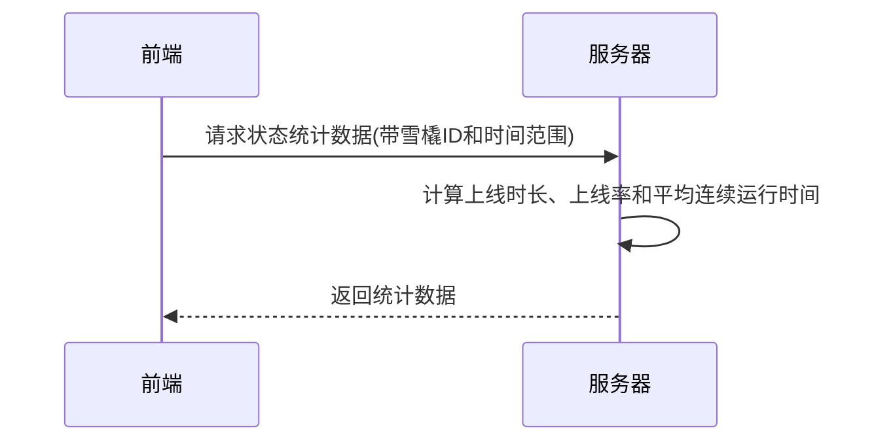

### 请求参数
```
?skidId=SK001&timeRange=month
```

| 参数名 | 类型 | 必填 | 说明 | 示例值 |
|-------|-----|-----|------|-------|
| skidId | string | 是 | 雪橇编号 | SK001 |
| timeRange | string | 是 | 时间范围(week:最近一周,month:最近一个月,year:最近一年) | month |

### 响应参数
```json
{
  "code": 200,
  "message": "获取雪橇状态统计数据成功",
  "ok": true,
  "data": {
    "onlineHours": 168,
    "onlineRate": "85%",
    "avgRunningTime": 24
  }
}
```

| 参数名 | 类型 | 必填 | 说明 | 示例值 |
|-------|-----|-----|------|-------|
| code | int | 是 | 状态码 | 200 |
| message | string | 是 | 响应消息 | 获取雪橇状态统计数据成功 |
| ok | boolean | 是 | 是否成功 | true |
| data | object | 是 | 响应数据 | |
| data.onlineHours | number | 是 | 上线时长(小时) | 168 |
| data.onlineRate | string | 是 | 上线率(百分比) | "85%" |
| data.avgRunningTime | number | 是 | 平均连续运行时间(小时) | 24 | 