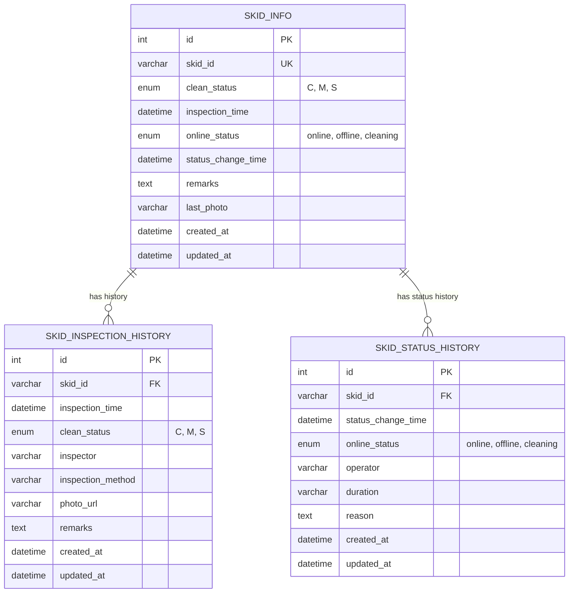

<!--
 * @Author: julius 2024-05-15 
 * @LastEditTime: 2024-05-15 19:00
-->

# 雪橇管理系统数据库设计文档

## 1. 数据库概述

雪橇管理系统数据库用于存储和管理雪橇的基本信息、清洁度检测历史以及上下线状态历史。该数据库支持雪橇一览表展示、清洁度历史查询、上下线历史记录等功能。

## 2. 数据库表结构

### 2.1 雪橇基本信息表 (skid_info)

存储雪橇的基本信息和当前状态。

| 字段名 | 数据类型 | 是否为空 | 描述 |
|------|---------|--------|------|
| id | INT | 否 | 自增主键 |
| skid_id | VARCHAR(20) | 否 | 雪橇编号（唯一） |
| clean_status | ENUM('C', 'M', 'S') | 否 | 清洁度状态：C-清洁，M-中度，S-严重 |
| inspection_time | DATETIME | 否 | 最新检测时间 |
| online_status | ENUM('online', 'offline', 'cleaning') | 否 | 上下线状态：online-在线，offline-离线，cleaning-清洗中 |
| status_change_time | DATETIME | 否 | 最新上下线状态变更时间 |
| remarks | TEXT | 是 | 备注 |
| last_photo | VARCHAR(255) | 是 | 最新检测照片URL |
| created_at | DATETIME | 否 | 创建时间（自动生成） |
| updated_at | DATETIME | 否 | 更新时间（自动更新） |

**索引**:
- PRIMARY KEY: `id`
- UNIQUE KEY: `skid_id`
- INDEX: `clean_status`, `online_status`

### 2.2 雪橇清洁度检测历史记录表 (skid_inspection_history)

存储雪橇清洁度的检测历史记录。

| 字段名 | 数据类型 | 是否为空 | 描述 |
|------|---------|--------|------|
| id | INT | 否 | 自增主键 |
| skid_id | VARCHAR(20) | 否 | 雪橇编号（外键） |
| inspection_time | DATETIME | 否 | 检测时间 |
| clean_status | ENUM('C', 'M', 'S') | 否 | 清洁度状态：C-清洁，M-中度，S-严重 |
| inspector | VARCHAR(50) | 否 | 检测人员 |
| inspection_method | VARCHAR(50) | 否 | 检测方式（如：自动检测、人工检测） |
| photo_url | VARCHAR(255) | 是 | 检测照片URL |
| remarks | TEXT | 是 | 备注 |
| created_at | DATETIME | 否 | 创建时间（自动生成） |
| updated_at | DATETIME | 否 | 更新时间（自动更新） |

**索引**:
- PRIMARY KEY: `id`
- INDEX: `skid_id`, `inspection_time`, `clean_status`
- FOREIGN KEY: `skid_id` REFERENCES `skid_info(skid_id)`

### 2.3 雪橇上下线历史表 (skid_status_history)

存储雪橇上下线的历史记录。

| 字段名 | 数据类型 | 是否为空 | 描述 |
|------|---------|--------|------|
| id | INT | 否 | 自增主键 |
| skid_id | VARCHAR(20) | 否 | 雪橇编号（外键） |
| status_change_time | DATETIME | 否 | 状态变更时间 |
| online_status | ENUM('online', 'offline', 'cleaning') | 否 | 上下线状态：online-在线，offline-离线，cleaning-清洗中 |
| operator | VARCHAR(50) | 否 | 操作人员 |
| duration | VARCHAR(50) | 是 | 持续时间（如：16小时25分） |
| reason | TEXT | 是 | 原因 |
| created_at | DATETIME | 否 | 创建时间（自动生成） |
| updated_at | DATETIME | 否 | 更新时间（自动更新） |

**索引**:
- PRIMARY KEY: `id`
- INDEX: `skid_id`, `status_change_time`, `online_status`
- FOREIGN KEY: `skid_id` REFERENCES `skid_info(skid_id)`

## 3. 数据库视图

### 3.1 雪橇当前状态视图 (v_skid_current_status)

提供雪橇当前状态和最近一次清洁度检测信息的综合视图。

```sql
CREATE OR REPLACE VIEW v_skid_current_status AS
SELECT 
  s.skid_id,
  s.clean_status,
  s.inspection_time,
  s.online_status,
  s.status_change_time,
  s.remarks,
  s.last_photo,
  ih.inspector AS last_inspector,
  ih.inspection_method AS last_inspection_method
FROM 
  skid_info s
LEFT JOIN 
  skid_inspection_history ih ON s.skid_id = ih.skid_id AND s.inspection_time = ih.inspection_time;
```

## 4. 常用查询示例

### 4.1 查询所有雪橇当前状态
```sql
SELECT * FROM v_skid_current_status;
```

### 4.2 查询清洁度为严重(S)的雪橇
```sql
SELECT * FROM v_skid_current_status WHERE clean_status = 'S';
```

### 4.3 查询在线状态的雪橇
```sql
SELECT * FROM v_skid_current_status WHERE online_status = 'online';
```

### 4.4 查询特定雪橇的清洁度检测历史记录
```sql
SELECT * FROM skid_inspection_history 
WHERE skid_id = 'SK001' 
ORDER BY inspection_time DESC;
```

### 4.5 查询特定雪橇的上下线历史记录
```sql
SELECT * FROM skid_status_history 
WHERE skid_id = 'SK001' 
ORDER BY status_change_time DESC;
```

### 4.6 查询最近一周内检测过的雪橇
```sql
SELECT DISTINCT skid_id 
FROM skid_inspection_history 
WHERE inspection_time >= DATE_SUB(NOW(), INTERVAL 1 WEEK);
```

### 4.7 查询上线时间超过24小时的雪橇
```sql
SELECT * 
FROM v_skid_current_status 
WHERE online_status = 'online' 
  AND status_change_time <= DATE_SUB(NOW(), INTERVAL 24 HOUR);
```

### 4.8 查询正在清洗中的雪橇
```sql
SELECT * 
FROM v_skid_current_status 
WHERE online_status = 'cleaning';
```

## 5. 表关系图

### 5.1 文本表示

```
+---------------+     +------------------------+
|   skid_info   |     | skid_inspection_history|
+---------------+     +------------------------+
| id (PK)       |     | id (PK)                |
| skid_id (UK)  |<----| skid_id (FK)           |
| clean_status  |     | inspection_time        |
| inspection_time     | clean_status           |
| online_status |     | inspector              |
| status_change_time  | inspection_method      |
| remarks       |     | photo_url              |
| last_photo    |     | remarks                |
| created_at    |     | created_at             |
| updated_at    |     | updated_at             |
+---------------+     +------------------------+
       ^                      
       |                      
       |                      
       |     +------------------------+
       +-----| skid_status_history    |
             +------------------------+
             | id (PK)                |
             | skid_id (FK)           |
             | status_change_time     |
             | online_status          |
             | operator               |
             | duration               |
             | reason                 |
             | created_at             |
             | updated_at             |
             +------------------------+
```

### 5.2 ER图

