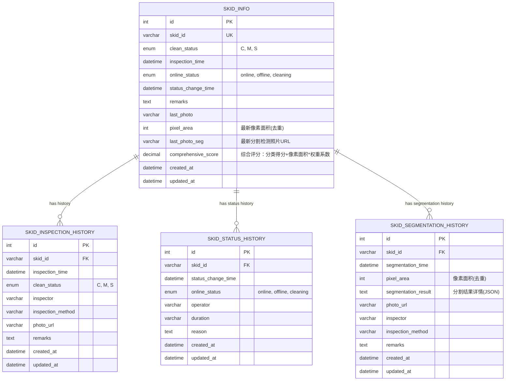

<!--
 * @Author: julius 2024-05-15
 * @LastEditTime: 2024-05-15 19:00
 * 创建者/修改者: chenliang；修改时间：2025年7月29日 21:55；主要修改内容：添加双模型检测支持，新增分割检测历史表和像素面积字段
 * 修改者: chenliang
 * 修改时间: 2025年8月25日9点30分
 * 主要修改内容: 根据service_v3.0.py验证数据库模型一致性，补充三种检测模式的数据库操作说明
 * 修改者: chenliang
 * 修改时间: 2025年8月6日11点30分
 * 主要修改内容: 添加v3.1综合评分功能，新增comprehensive_score字段，更新查询示例和ER图
-->

# 雪橇管理系统数据库设计文档

## 1. 数据库概述

雪橇管理系统数据库用于存储和管理雪橇的基本信息、清洁度检测历史、分割检测历史以及上下线状态历史。该数据库支持雪橇一览表展示、清洁度历史查询、分割检测历史查询、像素面积统计、上下线历史记录等功能。

**v3.0 新增功能**：
- 支持YOLO分割模型检测结果存储
- 像素面积计算和去重功能
- 分割检测历史记录管理
- 双模型检测结果关联

**v3.1 新增功能**：
- 综合评分计算和存储功能
- 分类结果与像素面积的综合评价
- 支持权重系数配置的综合评分算法

## 2. 数据库表结构

### 2.1 雪橇基本信息表 (skid_info)

存储雪橇的基本信息和当前状态。

| 字段名 | 数据类型 | 是否为空 | 描述 |
|------|---------|--------|------|
| id | INT | 否 | 自增主键 |
| skid_id | VARCHAR(20) | 否 | 雪橇编号（唯一） |
| clean_status | ENUM('C', 'M', 'S') | 否 | 清洁度状态：C-清洁，M-中度，S-严重 |
| inspection_time | DATETIME | 否 | 最新检测时间 |
| online_status | ENUM('online', 'offline', 'cleaning') | 否 | 上下线状态：online-在线，offline-离线，cleaning-清洗中 |
| status_change_time | DATETIME | 否 | 最新上下线状态变更时间 |
| remarks | TEXT | 是 | 备注 |
| last_photo | VARCHAR(255) | 是 | 最新检测照片URL |
| pixel_area | INT | 是 | 最新像素面积（去重后） |
| last_photo_seg | VARCHAR(255) | 是 | 最新分割检测照片URL |
| comprehensive_score | DECIMAL(10,3) | 是 | 综合评分：分类得分+像素面积*权重系数 |
| created_at | DATETIME | 否 | 创建时间（自动生成） |
| updated_at | DATETIME | 否 | 更新时间（自动更新） |

**索引**:
- PRIMARY KEY: `id`
- UNIQUE KEY: `skid_id`
- INDEX: `clean_status`, `online_status`

### 2.2 雪橇清洁度检测历史记录表 (skid_inspection_history)

存储雪橇清洁度的检测历史记录。

| 字段名 | 数据类型 | 是否为空 | 描述 |
|------|---------|--------|------|
| id | INT | 否 | 自增主键 |
| skid_id | VARCHAR(20) | 否 | 雪橇编号（外键） |
| inspection_time | DATETIME | 否 | 检测时间 |
| clean_status | ENUM('C', 'M', 'S') | 否 | 清洁度状态：C-清洁，M-中度，S-严重 |
| inspector | VARCHAR(50) | 否 | 检测人员 |
| inspection_method | VARCHAR(50) | 否 | 检测方式（如：自动检测、人工检测） |
| photo_url | VARCHAR(255) | 是 | 检测照片URL |
| remarks | TEXT | 是 | 备注 |
| created_at | DATETIME | 否 | 创建时间（自动生成） |
| updated_at | DATETIME | 否 | 更新时间（自动更新） |

**索引**:
- PRIMARY KEY: `id`
- INDEX: `skid_id`, `inspection_time`, `clean_status`
- FOREIGN KEY: `skid_id` REFERENCES `skid_info(skid_id)`

### 2.3 雪橇上下线历史表 (skid_status_history)

存储雪橇上下线的历史记录。

| 字段名 | 数据类型 | 是否为空 | 描述 |
|------|---------|--------|------|
| id | INT | 否 | 自增主键 |
| skid_id | VARCHAR(20) | 否 | 雪橇编号（外键） |
| status_change_time | DATETIME | 否 | 状态变更时间 |
| online_status | ENUM('online', 'offline', 'cleaning') | 否 | 上下线状态：online-在线，offline-离线，cleaning-清洗中 |
| operator | VARCHAR(50) | 否 | 操作人员 |
| duration | VARCHAR(50) | 是 | 持续时间（如：16小时25分） |
| reason | TEXT | 是 | 原因 |
| created_at | DATETIME | 否 | 创建时间（自动生成） |
| updated_at | DATETIME | 否 | 更新时间（自动更新） |

**索引**:
- PRIMARY KEY: `id`
- INDEX: `skid_id`, `status_change_time`, `online_status`
- FOREIGN KEY: `skid_id` REFERENCES `skid_info(skid_id)`

### 2.4 雪橇分割检测历史记录表 (skid_segmentation_history)

存储雪橇分割检测的历史记录和像素面积信息。

| 字段名 | 数据类型 | 是否为空 | 描述 |
|------|---------|--------|------|
| id | INT | 否 | 自增主键 |
| skid_id | VARCHAR(20) | 否 | 雪橇编号（外键） |
| segmentation_time | DATETIME | 否 | 分割检测时间 |
| pixel_area | INT | 是 | 像素面积（去重后） |
| segmentation_result | TEXT | 是 | 分割结果详情（JSON格式） |
| photo_url | VARCHAR(255) | 是 | 分割检测照片URL |
| inspector | VARCHAR(50) | 否 | 检测人员 |
| inspection_method | VARCHAR(50) | 否 | 检测方式（如：seg、cls+seg） |
| remarks | TEXT | 是 | 备注 |
| created_at | DATETIME | 否 | 创建时间（自动生成） |
| updated_at | DATETIME | 否 | 更新时间（自动更新） |

**索引**:
- PRIMARY KEY: `id`
- INDEX: `skid_id`, `segmentation_time`
- INDEX: `skid_id`, `segmentation_time` (复合索引)
- FOREIGN KEY: `skid_id` REFERENCES `skid_info(skid_id)`

## 3. 数据库视图

### 3.1 雪橇当前状态视图 (v_skid_current_status)

提供雪橇当前状态和最近一次清洁度检测信息的综合视图。

```sql
CREATE OR REPLACE VIEW v_skid_current_status AS
SELECT
  s.skid_id,
  s.clean_status,
  s.inspection_time,
  s.online_status,
  s.status_change_time,
  s.remarks,
  s.last_photo,
  s.pixel_area,
  s.last_photo_seg,
  ih.inspector AS last_inspector,
  ih.inspection_method AS last_inspection_method
FROM
  skid_info s
LEFT JOIN
  skid_inspection_history ih ON s.skid_id = ih.skid_id AND s.inspection_time = ih.inspection_time;
```

## 4. 常用查询示例

### 4.1 查询所有雪橇当前状态
```sql
SELECT * FROM v_skid_current_status;
```

### 4.2 查询清洁度为严重(S)的雪橇
```sql
SELECT * FROM v_skid_current_status WHERE clean_status = 'S';
```

### 4.3 查询在线状态的雪橇
```sql
SELECT * FROM v_skid_current_status WHERE online_status = 'online';
```

### 4.4 查询特定雪橇的清洁度检测历史记录
```sql
SELECT * FROM skid_inspection_history 
WHERE skid_id = 'SK001' 
ORDER BY inspection_time DESC;
```

### 4.5 查询特定雪橇的上下线历史记录
```sql
SELECT * FROM skid_status_history 
WHERE skid_id = 'SK001' 
ORDER BY status_change_time DESC;
```

### 4.6 查询最近一周内检测过的雪橇
```sql
SELECT DISTINCT skid_id 
FROM skid_inspection_history 
WHERE inspection_time >= DATE_SUB(NOW(), INTERVAL 1 WEEK);
```

### 4.7 查询上线时间超过24小时的雪橇
```sql
SELECT * 
FROM v_skid_current_status 
WHERE online_status = 'online' 
  AND status_change_time <= DATE_SUB(NOW(), INTERVAL 24 HOUR);
```

### 4.8 查询正在清洗中的雪橇
```sql
SELECT *
FROM v_skid_current_status
WHERE online_status = 'cleaning';
```

### 4.9 查询特定雪橇的分割检测历史
```sql
SELECT * FROM skid_segmentation_history
WHERE skid_id = 'SK001'
ORDER BY segmentation_time DESC;
```

### 4.10 查询像素面积大于指定值的雪橇
```sql
SELECT * FROM v_skid_current_status
WHERE pixel_area > 1000;
```

### 4.11 统计雪橇的平均像素面积
```sql
SELECT skid_id, AVG(pixel_area) as avg_pixel_area
FROM skid_segmentation_history
WHERE pixel_area IS NOT NULL
GROUP BY skid_id;
```

### 4.12 查询最近一周内进行过分割检测的雪橇
```sql
SELECT DISTINCT skid_id
FROM skid_segmentation_history
WHERE segmentation_time >= DATE_SUB(NOW(), INTERVAL 1 WEEK);
```

### 4.13 查询雪橇的像素面积变化趋势
```sql
SELECT skid_id, segmentation_time, pixel_area,
       LAG(pixel_area) OVER (PARTITION BY skid_id ORDER BY segmentation_time) as prev_pixel_area
FROM skid_segmentation_history
WHERE skid_id = 'SK001'
ORDER BY segmentation_time DESC;
```

### 4.14 v3.0 三种检测模式相关查询

#### 查询分类检测记录
```sql
SELECT * FROM skid_inspection_history 
WHERE inspection_method = 'auto_detection'
ORDER BY inspection_time DESC;
```

#### 查询分割检测记录
```sql
SELECT * FROM skid_segmentation_history 
WHERE inspection_method = 'seg'
ORDER BY segmentation_time DESC;
```

#### 查询双模型检测记录
```sql
-- 查询双模型检测的分类记录
SELECT * FROM skid_inspection_history 
WHERE inspection_method = 'cls+seg'
ORDER BY inspection_time DESC;

-- 查询双模型检测的分割记录
SELECT * FROM skid_segmentation_history 
WHERE inspection_method = 'cls+seg'
ORDER BY segmentation_time DESC;

-- 关联查询双模型完整记录
SELECT 
    i.skid_id,
    i.inspection_time,
    i.clean_status,
    s.pixel_area,
    i.photo_url as cls_photo,
    s.photo_url as seg_photo
FROM skid_inspection_history i
INNER JOIN skid_segmentation_history s 
    ON i.skid_id = s.skid_id 
    AND DATE(i.inspection_time) = DATE(s.segmentation_time)
    AND i.inspection_method = 'cls+seg' 
    AND s.inspection_method = 'cls+seg'
ORDER BY i.inspection_time DESC;
```

### 4.15 v3.1 综合评分相关查询

#### 查询综合评分大于指定值的雪橇
```sql
SELECT * FROM v_skid_current_status
WHERE comprehensive_score > 2.5;
```

#### 查询综合评分最高的雪橇（前10名）
```sql
SELECT skid_id, clean_status, comprehensive_score, pixel_area
FROM skid_info
WHERE comprehensive_score IS NOT NULL
ORDER BY comprehensive_score DESC
LIMIT 10;
```

#### 统计雪橇的综合评分分布
```sql
SELECT 
    CASE 
        WHEN comprehensive_score < 1.5 THEN '低评分'
        WHEN comprehensive_score < 2.5 THEN '中评分'
        ELSE '高评分'
    END as score_level,
    COUNT(*) as count
FROM skid_info
WHERE comprehensive_score IS NOT NULL
GROUP BY score_level
ORDER BY comprehensive_score;
```

#### 查询综合评分变化趋势（按时间排序）
```sql
SELECT 
    skid_id,
    inspection_time,
    clean_status,
    comprehensive_score,
    pixel_area,
    LAG(comprehensive_score) OVER (PARTITION BY skid_id ORDER BY inspection_time) as prev_score
FROM skid_info
WHERE comprehensive_score IS NOT NULL
ORDER BY skid_id, inspection_time DESC;
```

#### 查询特定雪橇的综合评分历史
```sql
SELECT 
    inspection_time,
    clean_status,
    comprehensive_score,
    pixel_area,
    comprehensive_score - LAG(comprehensive_score) OVER (ORDER BY inspection_time) as score_change
FROM skid_info
WHERE skid_id = 'SK001' AND comprehensive_score IS NOT NULL
ORDER BY inspection_time DESC;
```

## 5. 表关系图

### 5.1 文本表示

```
+---------------+     +------------------------+
|   skid_info   |     | skid_inspection_history|
+---------------+     +------------------------+
| id (PK)       |     | id (PK)                |
| skid_id (UK)  |<----| skid_id (FK)           |
| clean_status  |     | inspection_time        |
| inspection_time     | clean_status           |
| online_status |     | inspector              |
| status_change_time  | inspection_method      |
| remarks       |     | photo_url              |
| last_photo    |     | remarks                |
| pixel_area    |     | created_at             |
| last_photo_seg|     | updated_at             |
| comprehensive_score |     | +------------------------+
| created_at    |     |
| updated_at    |
+---------------+
       ^
       |
       |
       |     +------------------------+
       +-----| skid_status_history    |
       |     +------------------------+
       |     | id (PK)                |
       |     | skid_id (FK)           |
       |     | status_change_time     |
       |     | online_status          |
       |     | operator               |
       |     | duration               |
       |     | reason                 |
       |     | created_at             |
       |     | updated_at             |
       |     +------------------------+
       |
       |     +---------------------------+
       +-----| skid_segmentation_history |
             +---------------------------+
             | id (PK)                   |
             | skid_id (FK)              |
             | segmentation_time         |
             | pixel_area                |
             | segmentation_result       |
             | photo_url                 |
             | inspector                 |
             | inspection_method         |
             | remarks                   |
             | created_at                |
             | updated_at                |
             +---------------------------+
```

### 5.2 ER图



## 6. v3.0 数据库操作函数

### 6.1 三种检测模式的数据库操作

根据 `service_v3.0.py` 的实现，系统提供了三种专用的数据库操作函数：

#### 6.1.1 分类检测数据库操作
```python
def process_detection_result(self, skid_number: str, class_name: str, photo_url: str) -> dict:
```
**操作流程**：
1. 查询或创建雪橇记录
2. 更新 `skid_info` 表：`clean_status`, `last_photo`, `inspection_time`
3. 插入 `skid_inspection_history` 记录：`inspection_method='auto_detection'`
4. 条件性更新状态和插入 `skid_status_history`

#### 6.1.2 分割检测数据库操作
```python
def process_segmentation_result(self, skid_id: str, pixel_area: int, 
                              photo_url: str, segmentation_result: dict = None) -> dict:
```
**操作流程**：
1. 查询或创建雪橇记录
2. 更新 `skid_info` 表：`pixel_area`, `last_photo_seg`, `inspection_time`
3. 插入 `skid_segmentation_history` 记录：`inspection_method='seg'`
4. 条件性更新状态和插入 `skid_status_history`

#### 6.1.3 双模型检测数据库操作
```python
def process_dual_detection_result(self, skid_id: str, class_name: str, pixel_area: int,
                                cls_photo_url: str, seg_photo_url: str, 
                                segmentation_result: dict = None) -> dict:
```
**操作流程**：
1. 查询或创建雪橇记录
2. 更新 `skid_info` 表：所有相关字段（分类+分割）
3. 插入 `skid_inspection_history` 记录：`inspection_method='cls+seg'`
4. 插入 `skid_segmentation_history` 记录：`inspection_method='cls+seg'`
5. 条件性更新状态和插入 `skid_status_history`

### 6.2 数据库操作的统一特性

#### 事务安全
```python
try:
    # 执行所有数据库操作
    self.session.commit()
    return {"success": True, "message": "..."}
except SQLAlchemyError as e:
    self.session.rollback()
    logger.error(f"数据库操作失败: {str(e)}")
    return {"success": False, "message": f"Database error: {str(e)}"}
```

#### 状态变更逻辑
- 检查原 `online_status` 是否为 'online'
- 如果不是，则更新为 'online' 并记录状态变更历史
- 不同检测模式有不同的状态变更原因描述

#### 检测方式标识
| 检测模式 | inspection_method |
|----------|-------------------|
| 分类检测 | `auto_detection` |
| 分割检测 | `seg` |
| 双模型检测 | `cls+seg` |

### 6.3 调用示例

#### 在 service_v3.0.py 中的使用
```python
# 分类检测
db_result = save_detection_result_to_db(headers['skid_number'], "classification", {
    "class_name": class_name,
    "photo_url": img_url
})

# 分割检测
db_result = save_detection_result_to_db(headers['skid_number'], "segmentation", {
    "pixel_area": pixel_area,
    "photo_url": img_url,
    "segmentation_result": segmentation_result
})

# 双模型检测
db_result = save_detection_result_to_db(headers['skid_number'], "dual", {
    "class_name": class_name,
    "pixel_area": pixel_area,
    "cls_photo_url": cls_img_url,
    "seg_photo_url": seg_img_url,
    "segmentation_result": segmentation_result
})
```